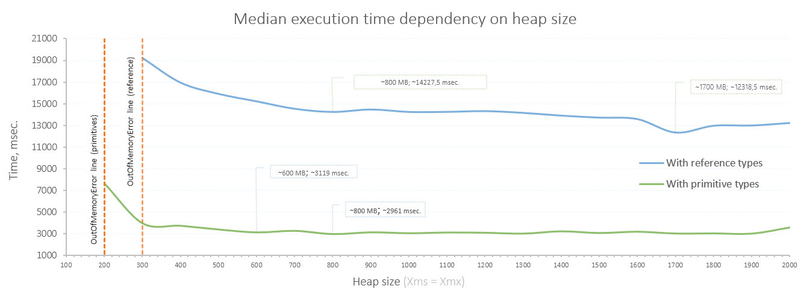

<!DOCTYPE html>
<html lang="en">
<head>
    <meta charset="UTF-8">
</head>
<body>

<h1>
    ⬛ Project: hw04-gc
</h1>
    

        <b>Status:</b> ✅ Resolved
         <b>Name:</b> «‎Определение нужного размера хипа»
         <b>Goal:</b> На примере простого приложения понять какое влияние оказывают сборщики мусора
        <h2>Steps:</h2>
        <ol>
            <li>
                Есть готовое приложение (модуль homework). Запустите его с размером хипа 256 Мб и посмотрите в логе 
                время выполнения. Пример вывода: <i>spend msec:18284, sec:18</i>
            </li>
            <li>
                Увеличьте размер хипа до 2Гб, замерьте время выполнения.
            </li>
            <li>
                Результаты запусков запишите в таблицу.
            </li>
            <li>
                Определите оптимальный размер хипа, т.е. размер, превышение которого, не приводит к сокращению времени 
                выполнения приложения.
            </li>
            <li>
                Оптимизируйте работу приложения. Т.е. не меняя логики работы (но изменяя код), сделайте так, чтобы 
                приложение работало быстро с минимальным хипом.
            </li>
            <li>
                Повторите измерения времени выполнения программы для тех же значений размера хипа.
            </li>
        </ol>
        <h2>Result:</h2>
        

            <b>Чем замерялось:</b> для замера значений времени исполнения в зависимости от разрмера heap'а 
            использовалась java.time.LocalDateTime (задано изначально по заданию).
             <b>Как замерялось:</b> для того, чтобы гарантировать доступность памяти для каждого запуска параметр 
            <i>-Xms</i> равнялся <i>-Xmx</i>. Для каждого установленого размер heap'а запуск выполнялся 4 раза 
            последовательно друг за другом. Выбросы данных отсеивались выбором медианы значений времени.
             <b>Ограничения:</b> RAM ограничена сверху 2GB.
             
             <b>Результат на ссылочных типах данных:</b>
            <ul>
                <li>
                    Минимум времени, минимум памяти: ~14227,5 msec. при ~800 MB;
                </li>
                <li>
                    Лучший показатель: ~12318,5 msec. при ~1700 MB;
                </li>
            </ul>
            <b>Результат при замене ссылочных типов на примитивы:</b>
            <ul>
                <li>
                    Минимум времени, минимум памяти: ~3119 msec. при ~600 MB;
                </li>
                <li>
                    Лучший показатель: ~2961 msec. при ~800 MB;
                </li>
            </ul>
        

        
    

</body>
</html>